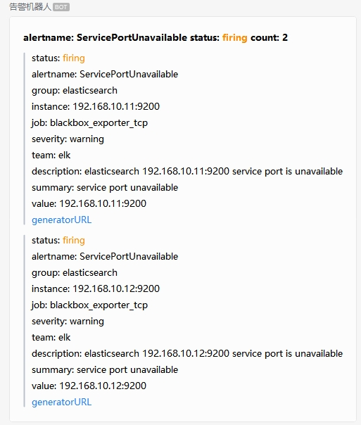
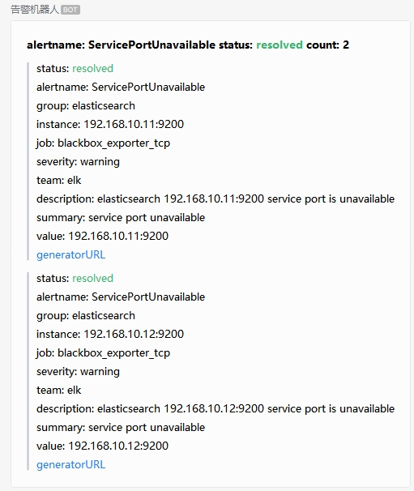
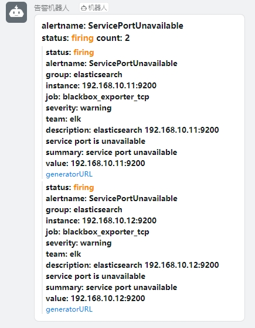
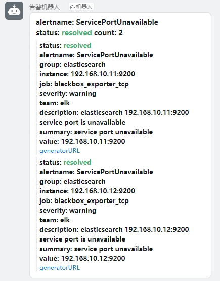

# AlertManager Webhook

<div>
  <a href="https://www.python.org/" target="_bank">
    
  </a>
  <a href="https://fastapi.tiangolo.com/" target="_bank">
    
  </a>
  <a href="https://jinja.palletsprojects.com/en/3.1.x/" target="_bank">
    
  </a>
  <a href="https://docs.aiohttp.org/en/stable/index.html" target="_bank">
    
  </a>
</div>


## 简介

`AlertManager Webhook` 是一个基于`FastApi`开发的插件，用于接收`AlertManager`组件发送的告警信息，并通过指定的模板渲染后发送至企业微信机器人或者钉钉机器人的`webhook`

## 默认的消息模板展示

企业微信消息：

 

钉钉消息：

 

## 配置和部署

### 自定义消息模板

所有模板默认放在`templates`目录下，可以通过环境变量`TEMPLATE`指定，模板使用`Jinja2`渲染，

模板语法请参考 :point_right: [Jinja2官方文档](https://jinja.palletsprojects.com/en/3.1.x/)

替换变量通过在模板中指定占位符`{{ }}`，例如

```shell
{{ items.alerts | length }}
{{ items.groupLabels.get('alertname') }}
{{ items.groupLabels['alertname'] }}
```

循环语法

```shell

 {{ key }}: {{ value }}

```

分支语法
```shell

<font color="#FF8C00">

<font color="#3CB371">

{{ items.status }}
</font>
```

空白控制，模板引擎默认不会对空白（空格、制表符、换行等）处理，可以在代码块开始或结束的位置放置特殊符号`-`来移除代码块前或代码块后的空白

```shell

> {{ key }}: {{ value }}

```

### alertmanager中的配置

```yaml
# receivers配置
receivers:
- name: 'dingtalk-webhook'
  webhook_configs:
  - send_resolved: true
    # 使用默认的模板dingtalk.tmpl
    url: 'http://alertmanager-webhook:8000/dingtalk'

- name: 'wechat-webhook'
  webhook_configs:
  - send_resolved: true
    # 使用tmpl参数指定模板wechat01.tmpl
    url: 'http://alertmanager-webhook:8000/wechat?tmpl=wechat01.tmpl'
```

### 构建容器镜像

```bash
docker build -t alertmanager-webhook:v1 .
```
    
### 部署

环境变量说明：
* GRAFANA_URL: grafana访问的地址，用于拼接generatorURL，默认是http://grafana:3000
* DINGTALK_WEBHOOK: 钉钉机器人的webhook地址
* DINGTALK_SECRET: 钉钉机器人的密钥
* DINGTALK_TEMPLATE: 默认的钉钉机器人的消息模板，默认是dingtalk.tmpl
* WECHAT_WEBHOOK: 企业微信机器人的webhook地址
* WECHAT_TEMPLATE: 默认的企业微信机器人的消息模板，默认是wechat.tmpl
* DEBUG: 是否开启调试模式，默认false

#### docker命令行部署

```bash
docker run -d --name alertmanager-webhook -e GRAFANA_URL="xxx" -e DINGTALK_WEBHOOK="xxx" -e DINGTALK_SECRET="xxx" -e DINGTALK_TEMPLATE="dingtalk.tmpl" -e WECHAT_WEBHOOK="xxx" -e WECHAT_TEMPLATE="wechat.tmpl" -e DEBUG=false -p 8000:8000 alertmanager-webhook:v1
```

#### docker-compose编排文件部署

```yaml
version: "3"

services:
  alertmanager-webhook:
    container_name: alertmanager-webhook
    hostname: alertmanager-webhook
    image: alertmanager-webhook:v1
    ports:
      - 8000:8000
    environment:
      - GRAFANA_URL=xxx
      - DINGTALK_WEBHOOK=https://oapi.dingtalk.com/robot/send?access_token=xxx
      - DINGTALK_SECRET=xxx
      - DINGTALK_TEMPLATE=dingtalk.tmpl
      - WECHAT_WEBHOOK=https://qyapi.weixin.qq.com/cgi-bin/webhook/send?key=xxx
      - WECHAT_TEMPLATE=wechat.tmpl
      - DEBUG=true
    volumes:
      - ./templates:/workspace/templates
    logging:
      driver: json-file
      options:
        max-size: 100m
        max-file: "3"
    networks:
      - lpg

networks:
  lpg:
    ipam:
      driver: default # default is bridge
      config:
        - subnet: 172.30.0.0/16
```

#### kubernetes编排文件部署

```yaml
# 自定义的模板文件可以使用pvc,configMap或其他方式挂载到容器中，看实际需求配置
apiVersion: apps/v1
kind: Deployment
metadata:
  creationTimestamp: null
  labels:
    app: alertmanager-webhook
  name: alertmanager-webhook
spec:
  replicas: 1
  selector:
    matchLabels:
      app: alertmanager-webhook
  strategy: {}
  template:
    metadata:
      creationTimestamp: null
      labels:
        app: alertmanager-webhook
    spec:
      containers:
      - name: alertmanager-webhook
        image: harbor.example.com/common-test/alertmanager-webhook:v1
        imagePullPolicy: IfNotPresent
        env:
        - name: GRAFANA_URL
          value: "http://grafana:3000"
        - name: DINGTALK_WEBHOOK
          value: "https://oapi.dingtalk.com/robot/send?access_token=xxx"
        - name: DINGTALK_SECRET
          value: "xxx"
        - name: DINGTALK_TEMPLATE
          value: "dingtalk.tmpl"
        - name: WECHAT_WEBHOOK
          value: "https://qyapi.weixin.qq.com/cgi-bin/webhook/send?key=xxx"
        - name: WECHAT_TEMPLATE
          value: "wechat.tmpl"
        - name: DEBUG
          value: "true"
        resources: {}
      imagePullSecrets:
      - name: harbor-secret
status: {}
---
apiVersion: v1
kind: Service
metadata:
  creationTimestamp: null
  labels:
    app: alertmanager-webhook
  name: alertmanager-webhook
spec:
  ports:
  - name: http
    port: 8000
    protocol: TCP
    targetPort: 8000
  selector:
    app: alertmanager-webhook
  type: NodePort
status:
  loadBalancer: {}
```